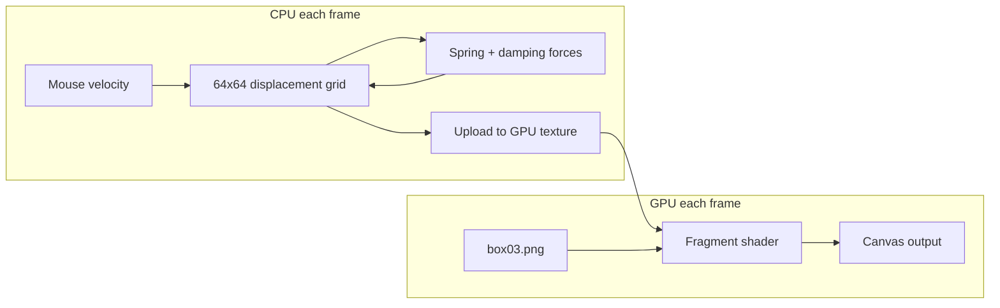

# Smoke Drag WebGL Panel Effect

## Architecture

The effect uses a small displacement grid simulated on CPU with spring-damper physics, uploaded to a WebGL texture each frame. The fragment shader offsets the `box03.png` texture UVs by the displacement, creating the "drag and snap back" behavior.




**Layer stack (back to front):**

1. `::before` — ambient SVG flag-wave (unchanged)
2. `<canvas>` — WebGL smoke drag (new, replaces `::after`)
3. Panel content (buttons)

## Files to create/modify

### New file: `[src/js/smokePanel.js](src/js/smokePanel.js)`

Standalone module, no Three.js dependency. Exports a single `initSmokePanel(canvas, textureUrl)` function.

- **WebGL setup**: fullscreen quad (2 triangles), two textures (main texture + displacement), one shader program
- **Displacement grid** (64x64): each cell stores `{dx, dy, vx, vy}` (displacement + velocity)
- **Physics** per cell per frame:

```
  acceleration = -k * displacement - damping * velocity
  velocity += acceleration * dt
  displacement += velocity * dt
  

```

  `k` (spring stiffness) ~4.0, `damping` ~3.0 — gives an organic "evaporate back" feel

- **Mouse influence**: on `mousemove`, compute mouse velocity; for grid cells within a radius (~0.15 in UV space), add velocity in the mouse direction, weighted by distance falloff and edge proximity (stronger near panel edges)
- **Shader**: samples displacement texture (R=dx, G=dy, encoded as 0.5=neutral), offsets main texture UVs. Pixels displaced outside the original [0,1] UV range get alpha fade-to-zero (the "evaporation" at borders)
- **Cleanup**: `destroy()` method to remove listeners and free GL resources

### Modify: `[index.html](index.html)`

- Add a `<canvas id="smoke-canvas">` inside `.panel`, before the buttons
- Replace the `initPanelMouse()` function with an import/init of `smokePanel.js`
- Move the inline `<script>` to a module `<script type="module">` so it can import the new file
- Remove the `#flag-wave-mouse` SVG filter (no longer needed; `#flag-wave` stays)

### Modify: `[styles/retro.css](styles/retro.css)`

- Remove `.panel::after` and `.panel:hover::after` rules (replaced by the canvas)
- Remove `--mx` / `--my` custom properties from `.panel`
- Add `#smoke-canvas` styles: `position: absolute; inset: -40px; z-index: -1; pointer-events: none;` (wider inset than before so dragged-out smoke has room to render before fading)

## Physics behavior summary


| Mouse action                   | What happens                                                                       |
| ------------------------------ | ---------------------------------------------------------------------------------- |
| Enter panel                    | Nothing yet (no velocity)                                                          |
| Move across surface            | Grid cells near cursor receive velocity in mouse direction; texture drags along    |
| Move across panel edge outward | Stronger drag (edge proximity weight), smoke visually "pulled out"                 |
| Stop moving                    | Spring forces pull displacement back; velocity dampens — looks like smoke settling |
| Leave panel                    | No new forces; existing displacements spring back organically                      |


## Performance notes

- The displacement grid is 64x64 = 4096 cells, updated on CPU — negligible cost
- One GL draw call per frame with two texture lookups — very cheap
- `requestAnimationFrame` loop only runs while the page is visible
- No Three.js loaded on the home page; raw WebGL keeps the bundle minimal

